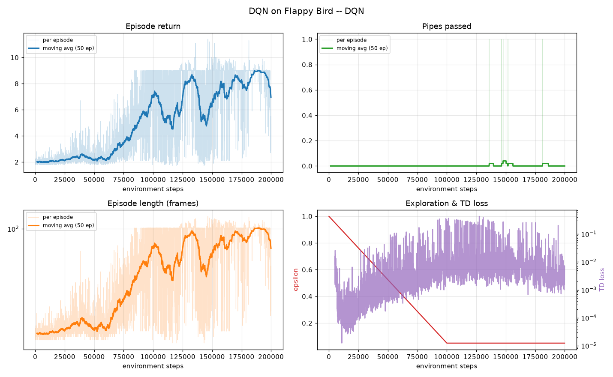
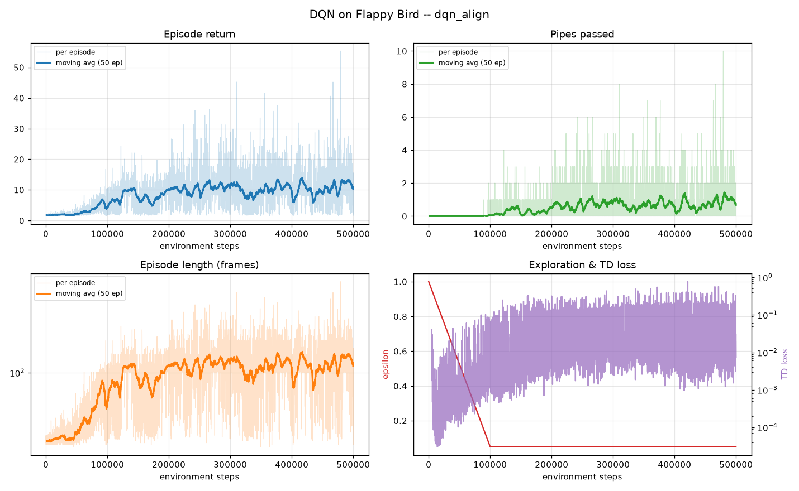
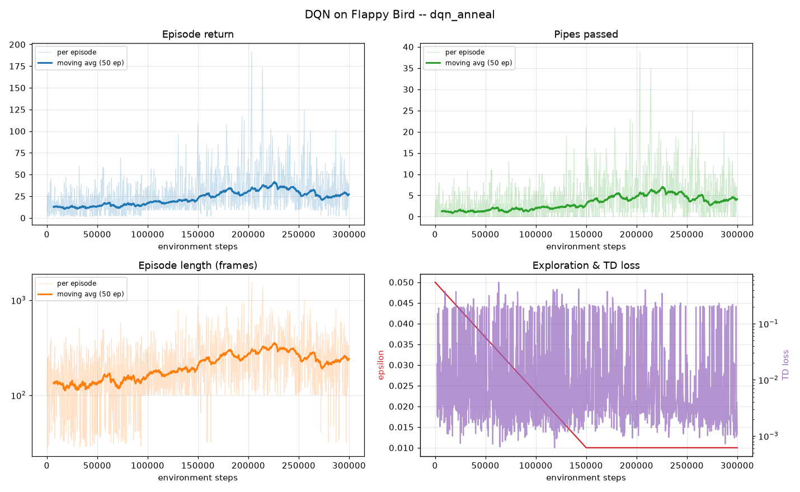

# DQN on Flappy Bird

A Double-DQN agent trained from scratch on the `FlappyBirdEnvSimple` environment
packaged in this repo, with a thin wrapper that fixes the environment's reward
and missing ceiling. Everything is plain PyTorch — no RL framework.

Built on [flappy-bird-gym](https://github.com/Talendar/flappy-bird-gym) by
[@Talendar](https://github.com/Talendar), whose original README is preserved in
[UPSTREAM_README.md](UPSTREAM_README.md).

The best agent reaches a **mean greedy score of 9 pipes** (peak episode: 39
pipes, ~1300 frames alive) after 500k + 300k environment steps on one GPU.

| | |
|---|---|
| Observation | `[h_dist, v_dist, player_y, vel_y]`, normalised |
| Action | `Discrete(2)` — 0 = nothing, 1 = flap |
| Reward | `+0.1`/frame alive, `+1`/pipe, `-1` on death |
| Network | MLP 4 → 128 → 128 → 2, ReLU |
| Algorithm | Double DQN, Huber loss, target net synced every 1k steps |
| γ | 0.99 (~100-frame horizon; deaths are caused 10–30 frames earlier) |

## Setup

The venv is already built at `.venv` (created with `uv`). To rebuild it:

```bash
uv venv .venv
uv pip install -p .venv "gym==0.26.2" numpy pygame torch matplotlib
```

The repo's own `setup.py` pins `gym~=0.18` / `numpy~=1.19`, which do not install
on a modern Python. The package is never pip-installed — the code sits inside the
repo, so `flappy_bird_gym` imports directly.

```bash
.venv/bin/python check.py    # unit tests for the four core RL functions
```

## Train

```bash
.venv/bin/python train.py --steps 500000 --run-name first_try
```

Writes to `runs/first_try/`:

- `log.csv` — per-episode return, score, length, epsilon, loss
- `progress.png` — refreshed every 20 episodes while training
- `model.pt` — saved at each eval

Then watch it play:

```bash
.venv/bin/python play.py --model runs/first_try/model.pt
```

### The recipe that actually worked

Two stages. Plain reward alone plateaus (see *Things I learned* below), so stage
one adds a gap-alignment shaping term and stage two anneals it away:

```bash
# stage 1: learn to aim at the gap
.venv/bin/python train.py --steps 500000 --align-penalty 0.05 --run-name dqn_align

# stage 2: fine-tune with the shaping annealed to zero, low exploration
.venv/bin/python train.py --steps 300000 --init-model runs/dqn_align/model.pt \
    --align-penalty 0.05 --align-penalty-final 0.0 --align-anneal-steps 100000 \
    --eps-start 0.05 --eps-end 0.01 --run-name dqn_anneal
```

## Results

Every run writes a four-panel `progress.png`, refreshed every 20 episodes while
training: episode return, pipes passed, episode length, and epsilon against TD
loss. Faint line = per episode, solid = 50-episode moving average.

### The plain reward stalls



This is the failure mode, and it is unusually legible. Return climbs to exactly
**9.0 and flattens into a hard ceiling** — the band of per-episode values has a
lid on it, not a spread. Episode length pins at ~100 frames for the same reason,
and *pipes passed stays at zero* for the whole 200k steps apart from four
one-off spikes. The agent found "hover near the top, survive to the first pipe,
die", and with no variance in the return there is nothing left to learn from.
Note that the TD loss keeps rising the whole time: the network is still fitting
something, just nothing that helps.

### Stage 1 — with the alignment penalty



Adding `--align-penalty 0.05` breaks the plateau. The 9.0 lid is gone, return
climbs to a ~10-12 moving average with per-episode spikes past 50, and pipes
passed finally leaves the floor — moving average around 0.9, with individual
episodes reaching 10. Episode length roughly triples off its starting value.
Progress is slow after ~200k steps, which is the shaping term doing its job and
then becoming the constraint: it is now rewarding gap-centring rather than
pipes.

### Stage 2 — annealing the shaping away



Fine-tuning from the stage-1 checkpoint with the penalty annealed 0.05 → 0 over
100k steps. Pipes passed rises from ~1 to a 5-6 moving average with episodes
hitting 39, and episode length grows from ~130 to ~300 frames (log scale, with
the tail past 1000). Epsilon here starts at 0.05, not 1.0 — the policy is being
refined, not rediscovered.

Greedy evaluation (ε = 0, 5 episodes) during that stage-two run:

| step | mean score | mean return |
|---|---|---|
| 50k | 5.6 | 34.5 |
| 100k | **9.0** | 49.3 |
| 150k | 2.6 | 19.6 |
| 200k | 5.4 | 33.0 |
| 250k | **9.0** | 50.2 |
| 300k | 4.4 | 28.2 |

Training-episode averages over the last 100 episodes of each run:

| run | steps | mean score | best episode | mean episode length |
|---|---|---|---|---|
| `dqn` (plain reward) | 200k | 0.00 | 1 | 89 frames |
| `dqn_align` (stage 1) | 500k | 0.89 | 10 | 124 frames |
| `dqn_anneal` (stage 2) | 300k | 3.90 | 39 | 233 frames |

Training scores sit below eval scores because ε is still 0.01-0.05 — one random
flap at the wrong moment ends the episode. Eval-to-eval variance stays high
(9.0 → 2.6 → 9.0); DQN on this task is not monotone, so judge a run by its
envelope, not its last point.

## Files

| File | What it does |
|---|---|
| `flappy_env.py` | Observation/reward wrapper over the packaged env |
| `dqn.py` | Replay buffer, Q-network, Double-DQN agent |
| `check.py` | Unit tests for the buffer, ε-greedy, and the TD loss |
| `train.py` | Training loop, ε/shaping schedules, logging, eval |
| `plotting.py` | CSV logger + reward plots |
| `play.py` | Watch a trained agent with the pygame window |

The four functions that carry the algorithm are `ReplayBuffer.push`,
`ReplayBuffer.sample`, `DQNAgent.select_action`, and `DQNAgent.compute_loss`;
each is documented in place in `dqn.py` and tested individually by `check.py`.

## Things I learned

**The honest reward has a local optimum, and DQN finds it.** With just
`+0.1`/frame, `+1`/pipe, `-1`/death, training converged by ~60k steps to "hover
near the top, survive to the first pipe, die": return exactly 9.0 every episode,
one pipe passed in 1341 episodes — the flat ceiling in the first plot above. The agent never observes the `+1`, so nothing
teaches it to descend. `--align-penalty 0.05` subtracts `0.05 * |v_dist|` per
frame, which supplies a gradient toward the gap *before* the first pipe is ever
cleared. The cost is that it rewards gap-centring, which the task does not
require — so anneal it to 0 once scores take off, or it caps final play.

**The environment lies about its reward.** `flappy_bird_env_simple.py:141`
returns `reward = 1` on every step, despite a docstring promising reward equals
score gained. Training against it optimises nothing but frame count. The real
score is in `info["score"]`, which is what the wrapper uses.

**A missing ceiling can zero out the learning signal.** `game_logic.check_crash()`
tests only the ground and the pipes, so the bird can fly off the top of the
screen and stay there. Measured: with ~50% random flapping it pins at `y = -92`
and *every* episode ends at exactly frame 101, when the first pipe arrives.
Identical returns across all episodes means zero variance and therefore nothing
to learn from. `ceiling_kills=True` (the default) makes leaving the top a death.

**The observation was not Markov.** The packaged env yields only
`(h_dist, v_dist)`. The same position rising and falling look identical but
demand opposite actions, so `vel_y` has to be in the observation.

**Truncation is not termination.** An evaluation step cap does not mean the
future is worthless, so `truncated` must never be stored as `done`; the target
still bootstraps there. Only real deaths get the `(1 - dones)` mask, and that
mask is the sole path by which the `-1` death penalty enters the value function.

**Small silent bugs dominate.** Sampling from `self.capacity` instead of
`self.size` returns zero-filled rows early in training and quietly poisons the
buffer. A `(B, 1)` target against a `(B,)` prediction broadcasts to `(B, B)` and
produces a loss that looks plausible and means nothing. Both cost more time than
any hyperparameter did — `check.py` exists because of them.
